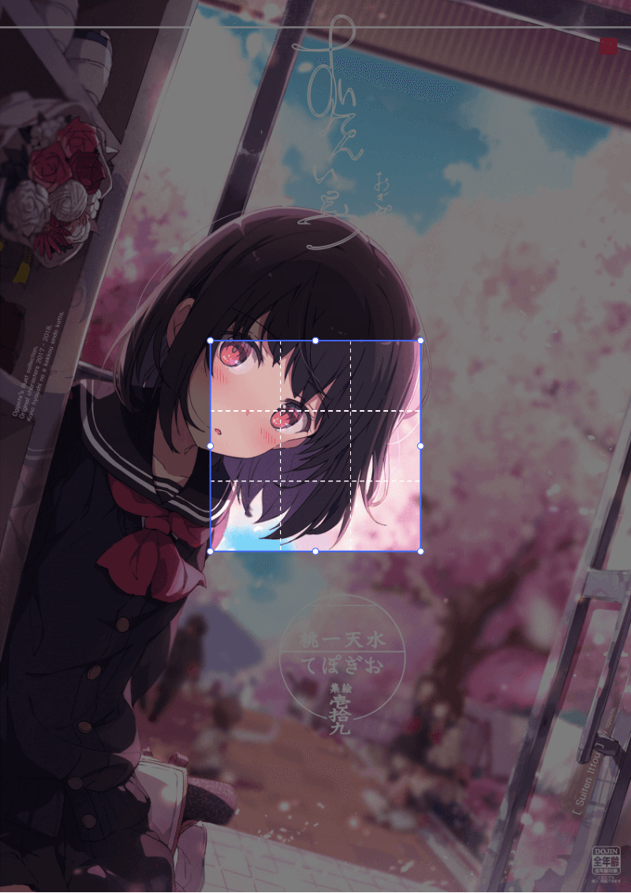
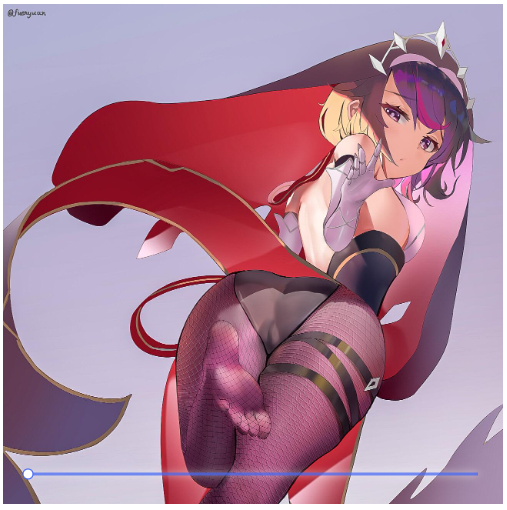

# 图片裁剪插件

支持两种裁剪方式。


<span> OR </sapn>

<br/>

## 代码片段

```js
var imageCropping = new ImageCropping({
    canvas: document.querySelector('canvas'), // 必填
    img: myImg, // 必填
    unfixed: {
        maxWidth: 800, // 可选，设置canvas宽度最大值
        // maxHeight      可选，设置canvas高度最大值
    },
});

// OR

var imageCropping = new ImageCropping({
    canvas: document.querySelector('canvas'), // 必填
    img: myImg, // 必填
    fixed: {
        width: 500, // 必填，设置canvas宽度最大值
        maximum: 8, // 可选，设置图片放大倍数默认6倍
    },
});
```

### 使用方法

[浏览 HTML 文件](https://github.com/aloneqi/imageCropping/blob/master/index.html)
